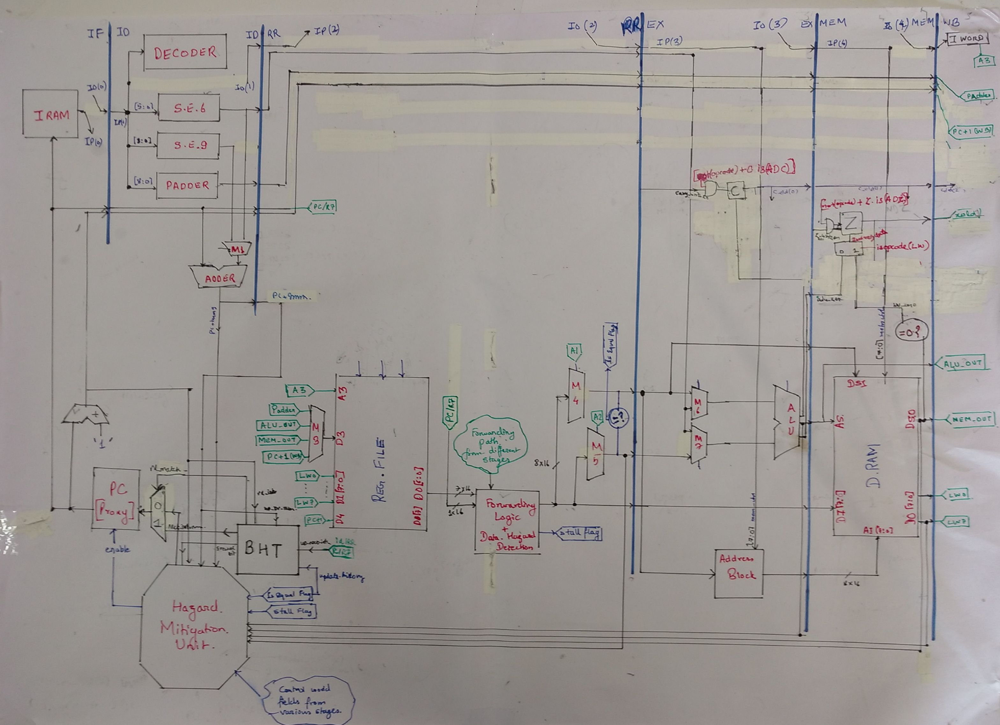

# 16b-Pipelined-RISC-
16 bit Pipelined RISC processor made as a part of EE309 Project at IIT Bombay
## The Final Datapath 

## File Dictionary
1. ALU.vhd : Contains VHDL codes for ALU
2. AddressBlock.vhd : Contains codes to compute addresses for LM/SM operations
3. BHT.vhd : Code for implementation of Branch History Table
4. Components.vhd : Final Package file having all the components
5. Datapath.vhd : VHDL implementation of Datapath
6. Entities.vhd : VHDL implementation of all small entities like add1, sign extender etc
7. FwdCntrl.vhd : VHDL implementation for forwarding logic
8. GenericMux.vhd : VHDL implementation of Generic Mux 
9. HazardUnit.vhd : VHDL implementation of Hazard Unit
10. Hazards.ods : ODS file having description of all hazards
11. InstructionDecoder.vhd : VHDL implementation of instruction decoder
12. PipelineRegister.vhd : VHDL implementation of pipelined regsiters
13. dRAM.vhd, iROM.vhd : VHDL implementation of instruction and data memory respectively
14. pilot.vhd: Final top level entity combining everything
15. regfile.vhd: VHDL implementation of register file
16. final_test.vhd : Final Testbench for pilot.vhd
